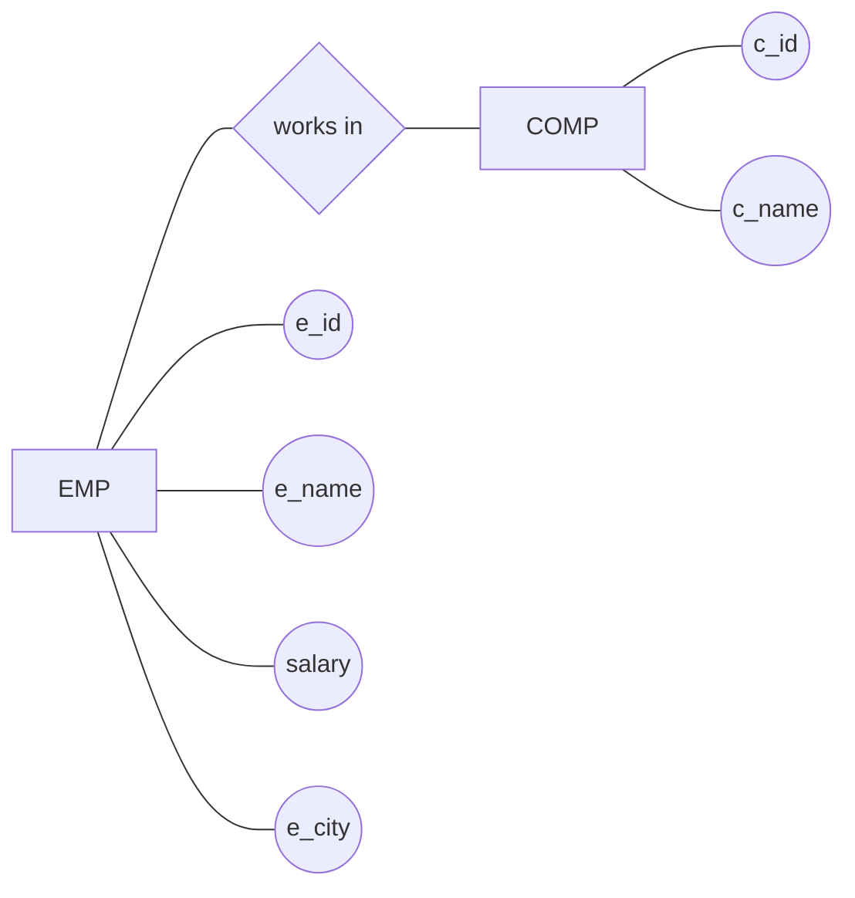
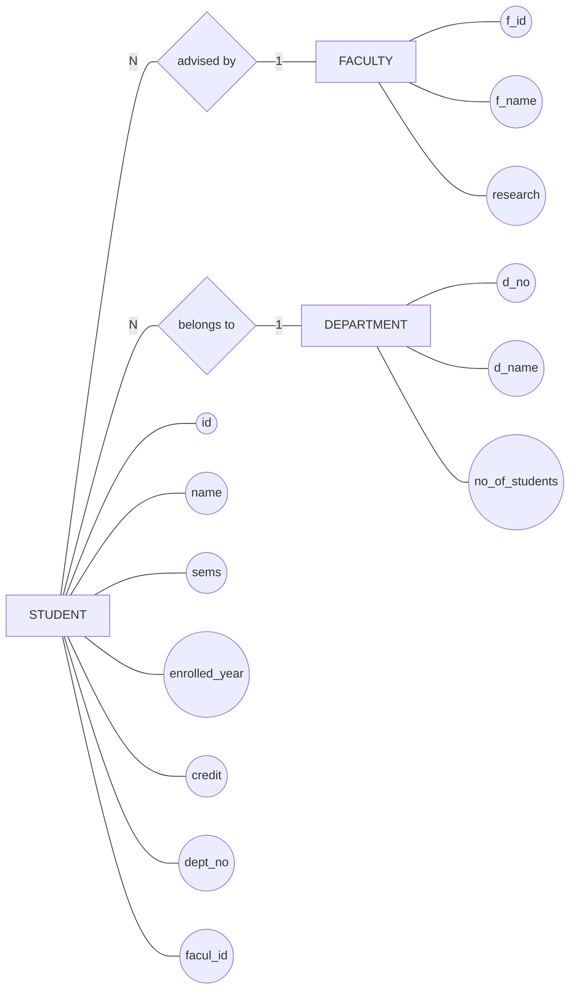
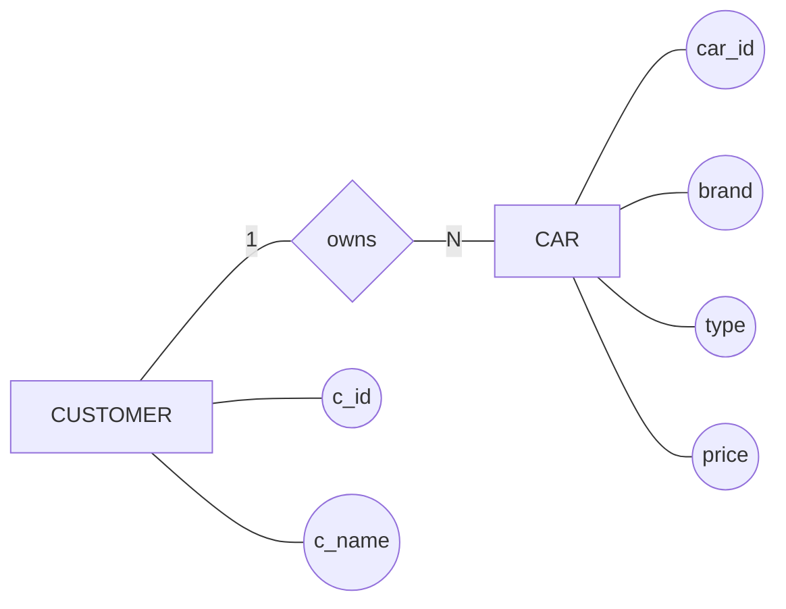
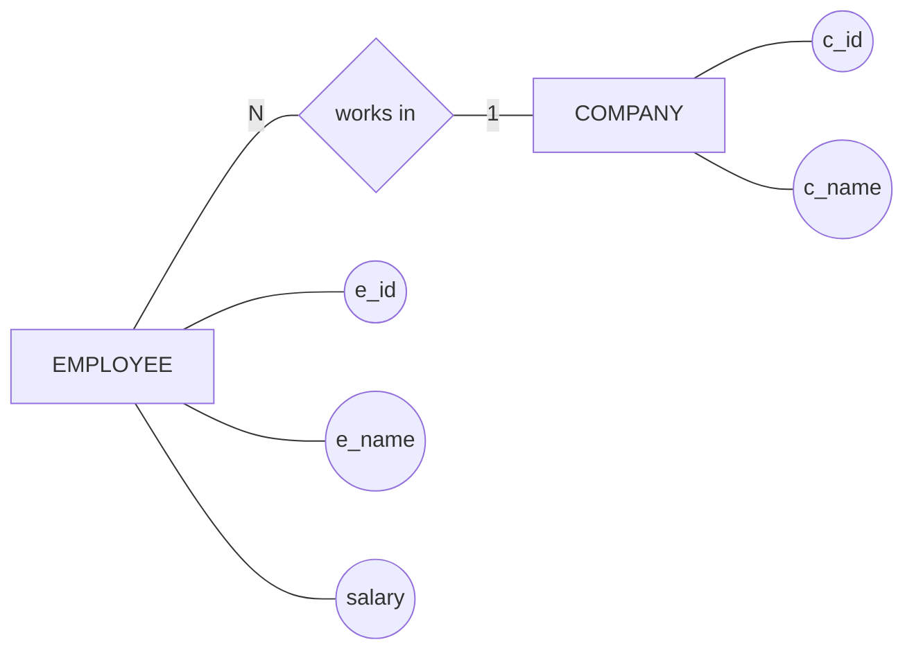
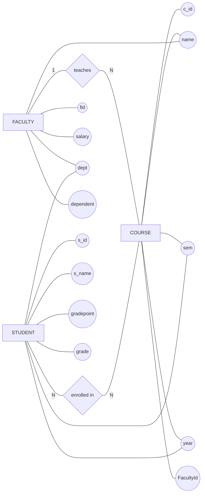

# ER Diagram (Proper ER Notation)

# ER Diagrams (With Proper Notation & Cardinality)

---

## 1️⃣ Student – Faculty – Department

---

## 2️⃣ Customer – Car

---

## 3️⃣ Employee – Company

---

## 📌 Cardinality Meaning

* **1** → One
* **N** → Many

### Examples:

* `STUDENT ---|N| ADVISED_BY ---|1| FACULTY`
  → Many students are advised by one faculty

* `CUSTOMER ---|1| OWNS ---|N| CAR`
  → One customer owns many cars

---

## ✅ Notes

* This uses **Mermaid Flowchart** to mimic real ER diagrams
* Diamonds = Relationships
* Ovals = Attributes
* Lines = Proper ER connections (no arrows)

---

# ER Diagram - Course, Faculty, Student

---

## 📌 Cardinality Explanation

* **FACULTY (1) — teaches — (N) COURSE**
  → One faculty can teach multiple courses

* **STUDENT (N) — enrolled in — (N) COURSE**
  → Many students can enroll in many courses (**M:N relationship**)

---

## ✅ Notes

* Diamonds = relationships
* Ovals = attributes
* Lines = proper ER connections
* This matches your handwritten diagram closely

---

