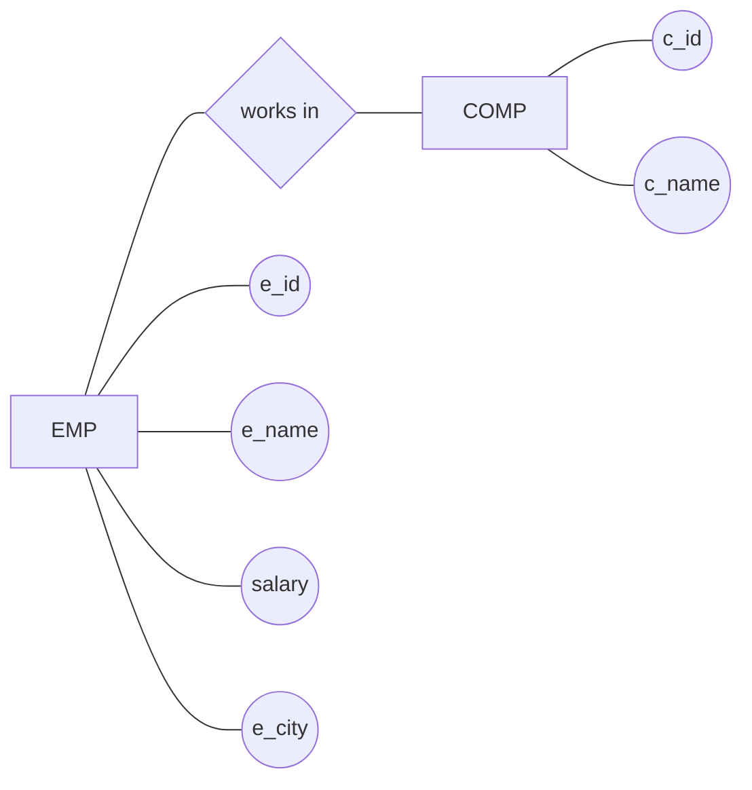
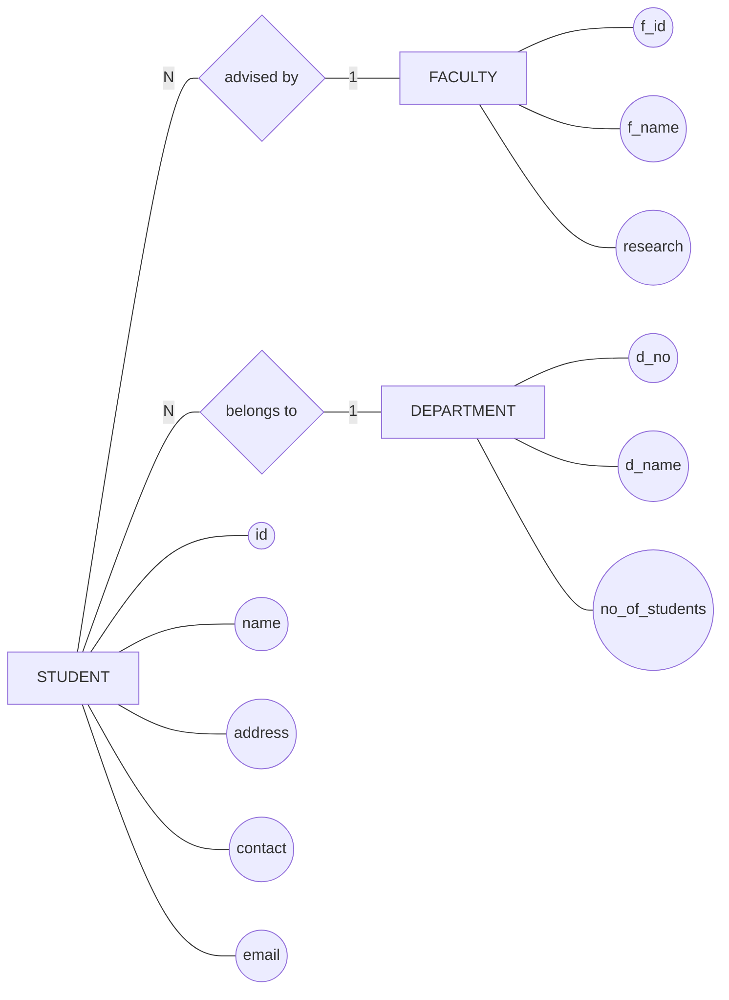
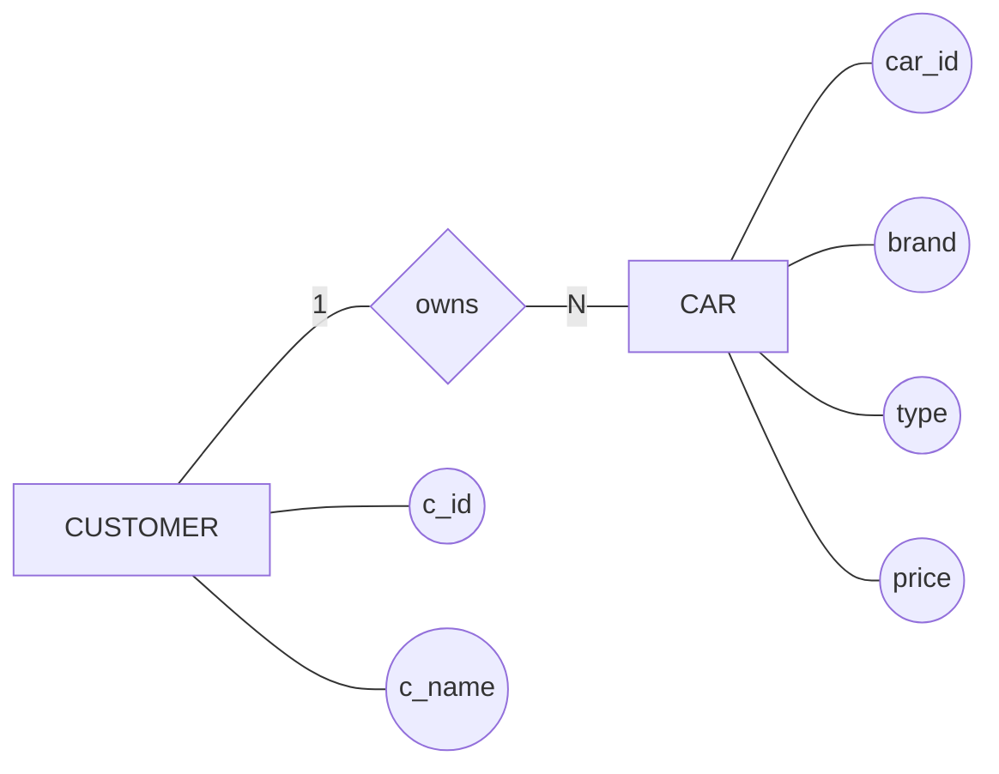
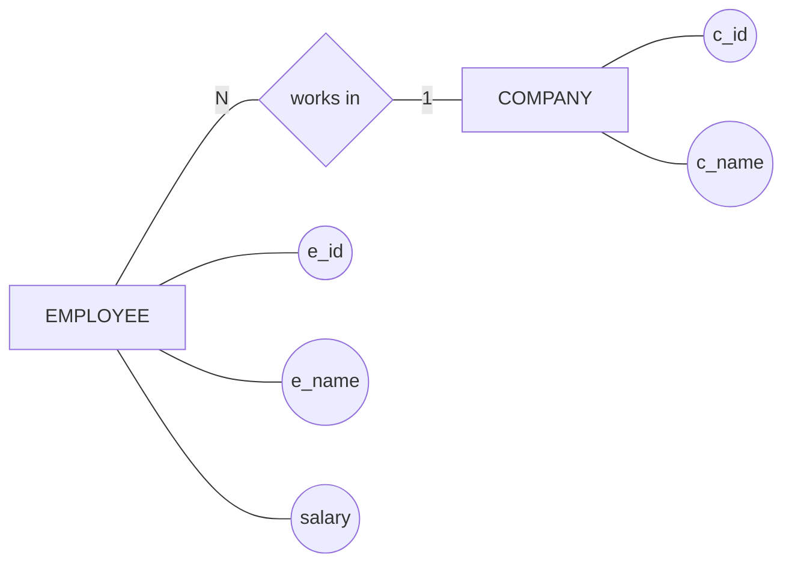

# ER Diagram (Proper ER Notation)

# ER Diagrams (With Proper Notation & Cardinality)

---

## 1️⃣ Student – Faculty – Department

---

## 2️⃣ Customer – Car

---

## 3️⃣ Employee – Company

---

## 📌 Cardinality Meaning

* **1** → One
* **N** → Many

### Examples:

* `STUDENT ---|N| ADVISED_BY ---|1| FACULTY`
  → Many students are advised by one faculty

* `CUSTOMER ---|1| OWNS ---|N| CAR`
  → One customer owns many cars

---

## ✅ Notes

* This uses **Mermaid Flowchart** to mimic real ER diagrams
* Diamonds = Relationships
* Ovals = Attributes
* Lines = Proper ER connections (no arrows)

---

