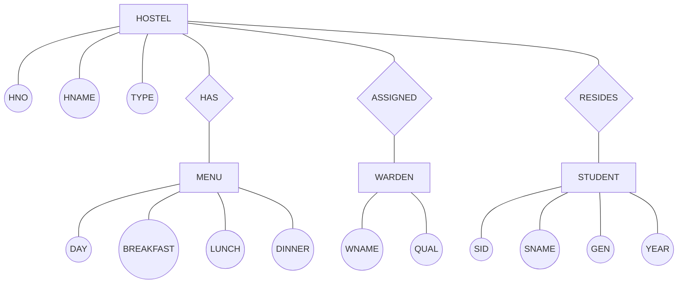

````md
# Hostel Mess Database - ER Diagram (Chen Notation)


```mermaid
flowchart TD

    %% Entities (Rectangles)
    HOSTEL[HOSTEL]
    MENU[MENU]
    WARDEN[WARDEN]
    STUDENT[STUDENT]

    %% Attributes (Ovals)
    HNO((HNO))
    HNAME((HNAME))
    TYPE((TYPE))

    SID((SID))
    SNAME((SNAME))
    GEN((GEN))
    YEAR((YEAR))

    WNAME((WNAME))
    QUAL((QUAL))

    DAY((DAY))
    BREAKFAST((BREAKFAST))
    LUNCH((LUNCH))
    DINNER((DINNER))

    %% Relationships (Diamonds)
    HAS_MENU{HAS}
    HAS_WARDEN{ASSIGNED}
    HAS_STUDENT{RESIDES}

    %% Connections - Hostel Attributes
    HOSTEL --- HNO
    HOSTEL --- HNAME
    HOSTEL --- TYPE

    %% Student Attributes
    STUDENT --- SID
    STUDENT --- SNAME
    STUDENT --- GEN
    STUDENT --- YEAR

    %% Warden Attributes
    WARDEN --- WNAME
    WARDEN --- QUAL

    %% Menu Attributes
    MENU --- DAY
    MENU --- BREAKFAST
    MENU --- LUNCH
    MENU --- DINNER

    %% Relationships
    HOSTEL --- HAS_MENU --- MENU
    HOSTEL --- HAS_WARDEN --- WARDEN
    HOSTEL --- HAS_STUDENT --- STUDENT
````

```
```
