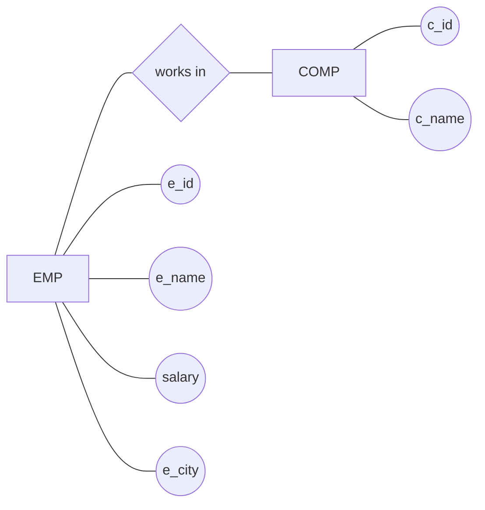
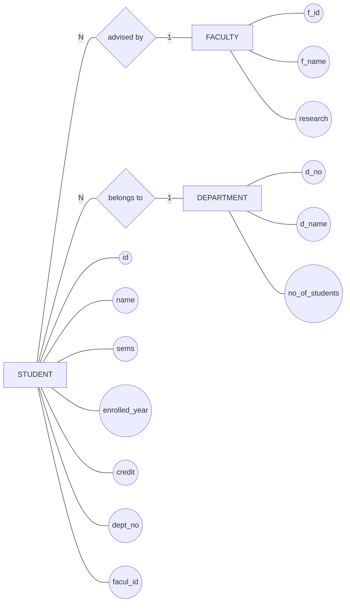
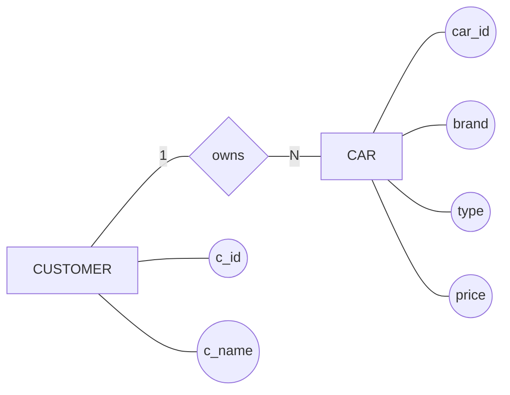
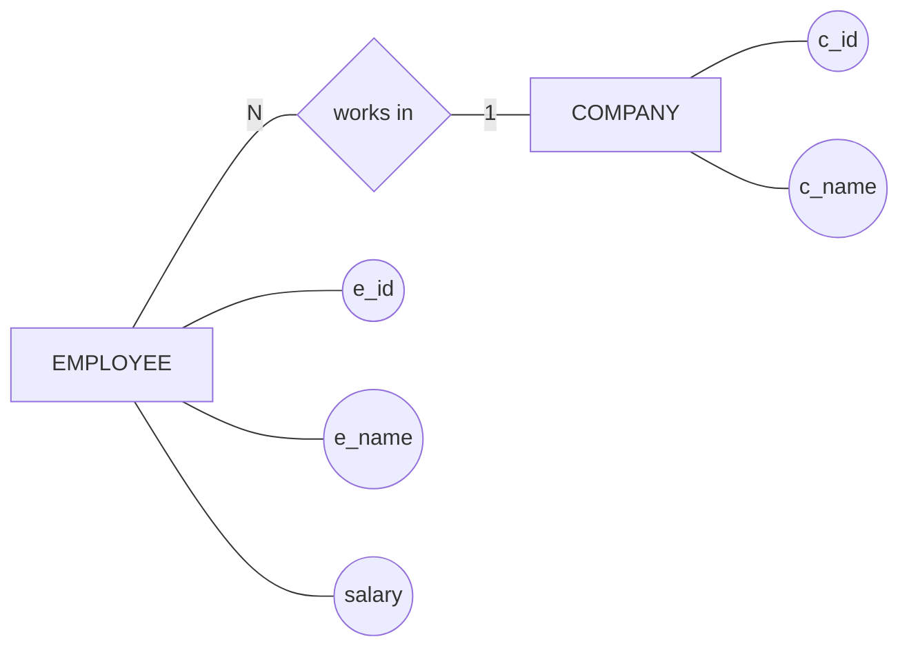
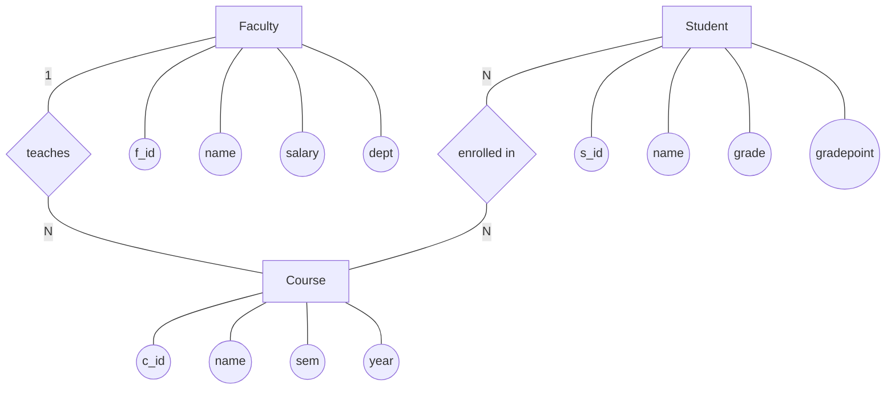
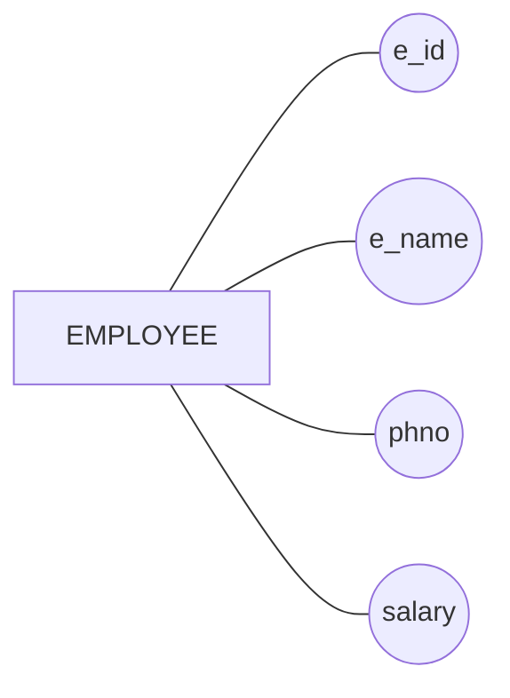

# ER Diagram (Proper ER Notation)



# ER Diagrams (With Proper Notation & Cardinality)

---

## 1️⃣ Student – Faculty – Department



---

## 2️⃣ Customer – Car



---

## 3️⃣ Employee – Company



---

## 📌 Cardinality Meaning

* **1** → One
* **N** → Many

### Examples:

* `STUDENT ---|N| ADVISED_BY ---|1| FACULTY`
  → Many students are advised by one faculty

* `CUSTOMER ---|1| OWNS ---|N| CAR`
  → One customer owns many cars

---

## ✅ Notes

* This uses **Mermaid Flowchart** to mimic real ER diagrams
* Diamonds = Relationships
* Ovals = Attributes
* Lines = Proper ER connections (no arrows)

---

# ER Diagram - Clean Layout (Course System)


## 3️⃣ Employee – Company


```mermaid
---
flowchart TB

    %% Entities
    CUSTOMER[Customer]
    ACCOUNT[Account]
    BRANCH[Branch]
    TRANSACTION[Transaction]

    %% Relationships
    OWNS{owns}
    BELONGS{belongs to}
    HAS_TXN{has transaction}

    %% Connections
    CUSTOMER ---|1| OWNS
    OWNS ---|N| ACCOUNT

    ACCOUNT ---|N| BELONGS
    BELONGS ---|1| BRANCH

    ACCOUNT ---|1| HAS_TXN
    HAS_TXN ---|N| TRANSACTION

    %% Attributes
    CUSTOMER --- c_id((CUSID))
    CUSTOMER --- c_name((CNAME))
    CUSTOMER --- location((LOC))

    ACCOUNT --- a_no((ANO))
    ACCOUNT --- balance((BAL))
    ACCOUNT --- start((SDATE))

    BRANCH --- b_id((BID))
    BRANCH --- b_name((FNAME))

```
