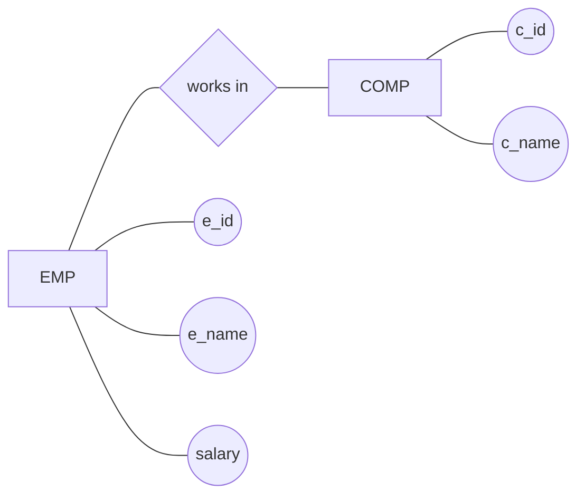

# ER Diagram (Proper ER Notation)

```mermaid
flowchart LR

    EMP[EMP]
    COMP[COMP]

    WORKS_IN{works in}

    EMP --- WORKS_IN
    WORKS_IN --- COMP

    EMP --- e_id((e_id))
    EMP --- e_name((e_name))
    EMP --- salary((salary))

    COMP --- c_id((c_id))
    COMP --- c_name((c_name))
```
