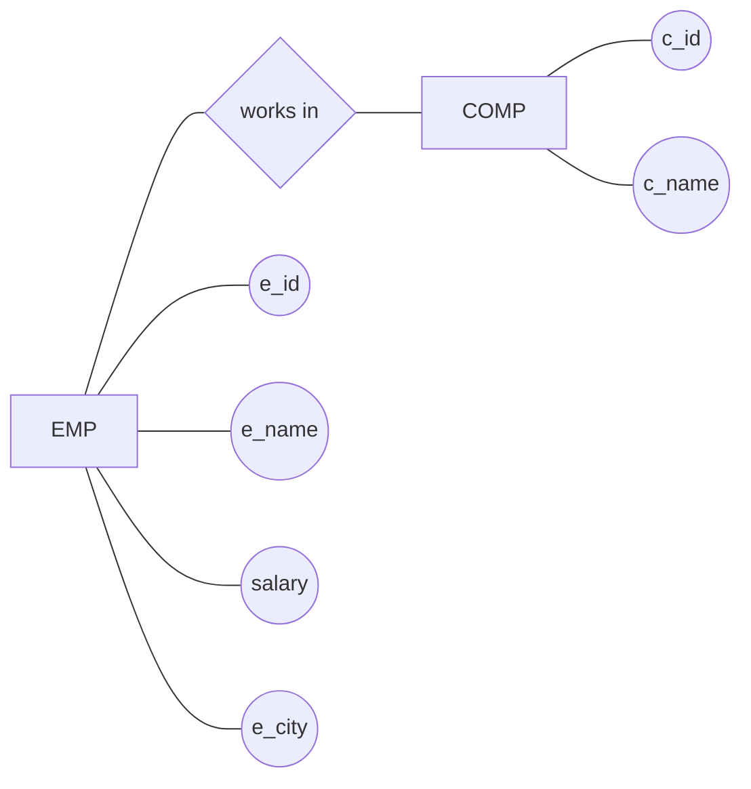
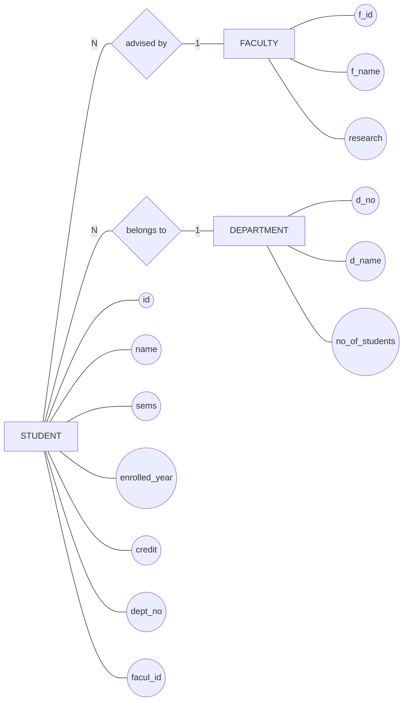
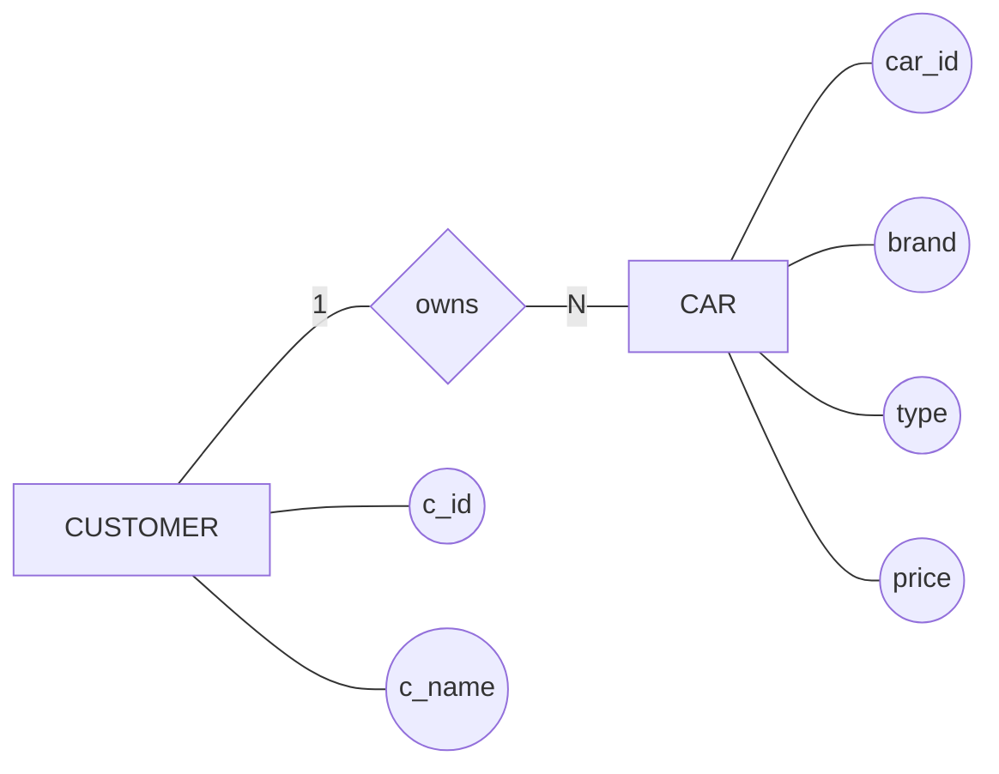
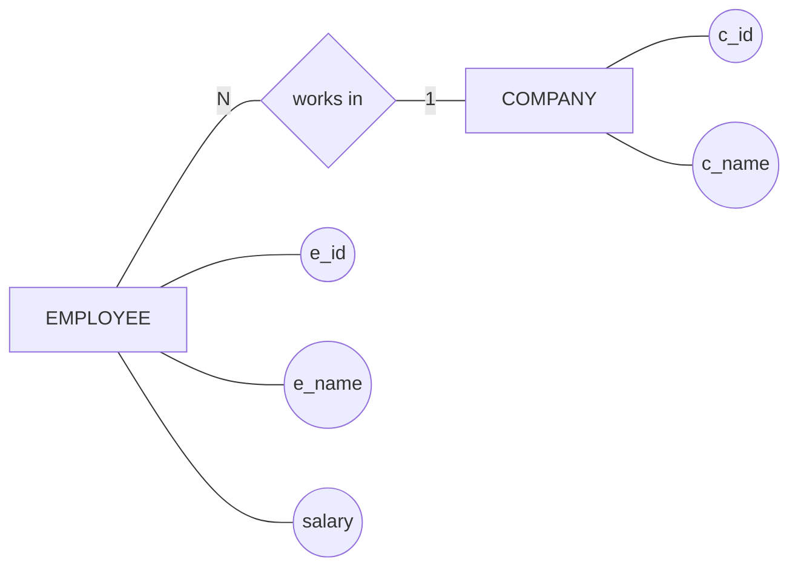
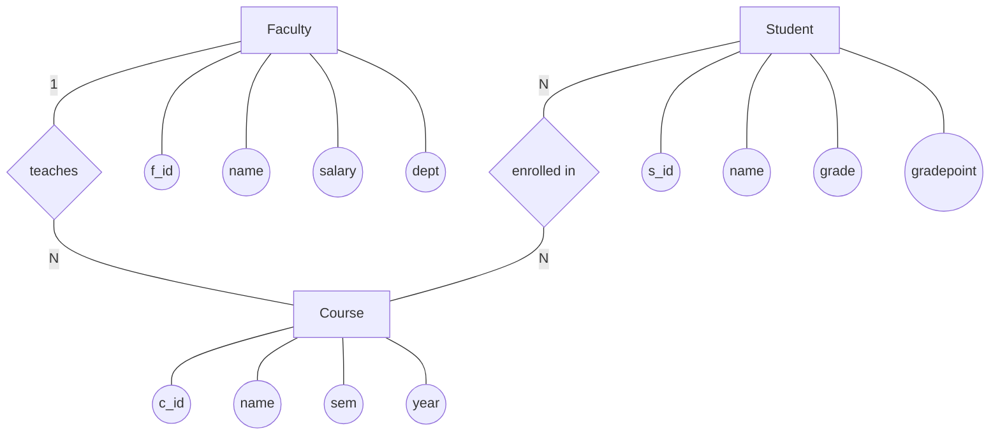
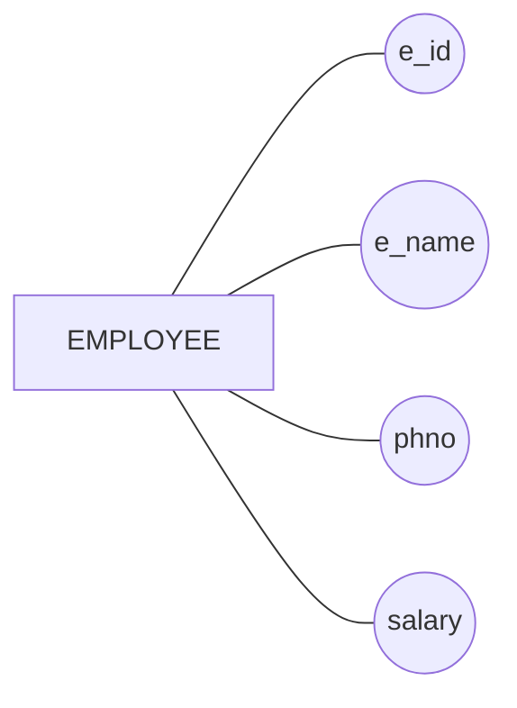

# ER Diagram (Proper ER Notation)

# ER Diagrams (With Proper Notation & Cardinality)

---

## 1️⃣ Student – Faculty – Department

---

## 2️⃣ Customer – Car

---

## 3️⃣ Employee – Company

---

## 📌 Cardinality Meaning

* **1** → One
* **N** → Many

### Examples:

* `STUDENT ---|N| ADVISED_BY ---|1| FACULTY`
  → Many students are advised by one faculty

* `CUSTOMER ---|1| OWNS ---|N| CAR`
  → One customer owns many cars

---

## ✅ Notes

* This uses **Mermaid Flowchart** to mimic real ER diagrams
* Diamonds = Relationships
* Ovals = Attributes
* Lines = Proper ER connections (no arrows)

---

# ER Diagram - Clean Layout (Course System)

## 3️⃣ Employee – Company

---

DBMS Experiment No.6.pdf
PDF
give all queries for this including creatingalso

Here are ALL SQL queries (complete solution) for your DBMS Experiment No. 6 — including table creation, insertion, and all required queries based on your uploaded file 

.

✅ 1. CREATE TABLE QUERIES
CREATE TABLE BRANCH (
    BID INT PRIMARY KEY,
    FNAME VARCHAR(50),
    FCITY VARCHAR(50)
);

CREATE TABLE CUSTOMER (
    CUSID INT PRIMARY KEY,
    CNAME VARCHAR(50),
    LOC VARCHAR(50)
);

CREATE TABLE ACCOUNT (
    ANO INT PRIMARY KEY,
    SDATE DATE,
    BAL NUMBER,
    CUSID INT,
    BID INT,
    FOREIGN KEY (CUSID) REFERENCES CUSTOMER(CUSID),
    FOREIGN KEY (BID) REFERENCES BRANCH(BID)
);

CREATE TABLE TRANSACTION (
    ANO INT,
    AMOUNT NUMBER,
    BID INT,
    T_DATE DATE,
    FOREIGN KEY (ANO) REFERENCES ACCOUNT(ANO),
    FOREIGN KEY (BID) REFERENCES BRANCH(BID)
);
✅ 2. INSERT DATA QUERIES (Sample Complete)
-- BRANCH
INSERT ALL
INTO BRANCH VALUES (1,'PAONA','IMPHAL')
INTO BRANCH VALUES (2,'THANGAL','IMPHAL')
INTO BRANCH VALUES (3,'CIRCLE','DELHI')
INTO BRANCH VALUES (4,'MANDI','MUMBAI')
SELECT * FROM DUAL;

-- CUSTOMER
INSERT ALL
INTO CUSTOMER VALUES (1,'LEONARD','NEW YORK')
INTO CUSTOMER VALUES (2,'RACHEL','KASHMIR')
INTO CUSTOMER VALUES (3,'ROSS','DELHI')
INTO CUSTOMER VALUES (4,'XYZ','MUMBAI')
SELECT * FROM DUAL;

-- ACCOUNT
INSERT ALL
INTO ACCOUNT VALUES (1, DATE '2013-08-02',10000,2,3)
INTO ACCOUNT VALUES (2, DATE '2014-01-10',20000,1,1)
INTO ACCOUNT VALUES (3, DATE '2015-05-15',17000,3,2)
INTO ACCOUNT VALUES (4, DATE '2016-07-20',16000,1,3)
INTO ACCOUNT VALUES (5, DATE '2017-03-11',26000,4,4)
SELECT * FROM DUAL;

-- TRANSACTION
INSERT ALL
INTO TRANSACTION VALUES (2,15000,1, DATE '2017-02-14')
INTO TRANSACTION VALUES (2,14000,1, DATE '2017-02-14')
INTO TRANSACTION VALUES (3,16000,2, DATE '2017-02-14')
SELECT * FROM DUAL;
✅ 3. REQUIRED SQL QUERIES
🔹 Q1: Average balance per branch (>10000)
SELECT B.FNAME, AVG(A.BAL) AS AVG_BAL
FROM BRANCH B
JOIN ACCOUNT A ON B.BID = A.BID
GROUP BY B.FNAME
HAVING AVG(A.BAL) > 10000;
🔹 Q2: Branches where city starts with 'i'
SELECT *
FROM BRANCH
WHERE FCITY LIKE 'I%';
🔹 Q3: Branch name with number of accounts
SELECT B.FNAME, COUNT(A.ANO) AS TOTAL_ACCOUNTS
FROM BRANCH B
LEFT JOIN ACCOUNT A ON B.BID = A.BID
GROUP BY B.FNAME;
🔹 Q4: Total balance of customer 'XYZ'
SELECT C.CNAME, SUM(A.BAL) AS TOTAL_BAL
FROM CUSTOMER C
JOIN ACCOUNT A ON C.CUSID = A.CUSID
WHERE C.CNAME = 'XYZ'
GROUP BY C.CNAME;
🔹 Q5: Accounts with balance between 10000 and 20000
SELECT A.ANO, C.CNAME, C.LOC, A.BAL
FROM ACCOUNT A
JOIN CUSTOMER C ON A.CUSID = C.CUSID
WHERE A.BAL BETWEEN 10000 AND 20000;
🔹 Q6: Transactions on 14-Feb-2017
SELECT C.CUSID, C.CNAME, T.AMOUNT, T.T_DATE
FROM TRANSACTION T
JOIN ACCOUNT A ON T.ANO = A.ANO
JOIN CUSTOMER C ON A.CUSID = C.CUSID
WHERE T.T_DATE = DATE '2017-02-14';
✅ Notes (Important for Viva 💡)
Use JOIN for combining tables

Use GROUP BY + HAVING for aggregate conditions

Use LIKE 'I%' for pattern matching

Use BETWEEN for range queries

Oracle uses DUAL for multi-row insert

If you want, I can also give:
✔ Output tables (same as your PDF screenshots)
✔ Viva questions + answers
✔ ER diagram for this database

Just tell me 👍

CREATE TABLE TRANSACTION ( ANO INT, AMOUNT NUMBER, BID INT, T_DATE DATE, FOREIGN KEY (ANO) REFERENCES ACCOUNT(ANO), FOREIGN KEY (BID) REFERENCES BRANCH(BID) ); Output Error: near "TRANSACTION": syntax error

The error is happening because TRANSACTION is a reserved keyword in SQL (used for COMMIT/ROLLBACK operations). So you cannot use it directly as a table name.

✅ ✅ FIX (Best Solution)
✔ Rename the table (recommended)
CREATE TABLE TRANSACTIONS (
    ANO INT,
    AMOUNT NUMBER,
    BID INT,
    T_DATE DATE,
    FOREIGN KEY (ANO) REFERENCES ACCOUNT(ANO),
    FOREIGN KEY (BID) REFERENCES BRANCH(BID)
);
✅ Alternative Fixes
✔ Option 2: Use quotes (not recommended for beginners)
CREATE TABLE "TRANSACTION" (
    ANO INT,
    AMOUNT NUMBER,
    BID INT,
    T_DATE DATE,
    FOREIGN KEY (ANO) REFERENCES ACCOUNT(ANO),
    FOREIGN KEY (BID) REFERENCES BRANCH(BID)
);
⚠ But then you must ALWAYS use quotes:

SELECT * FROM "TRANSACTION";
💡 Why this error occurs
TRANSACTION is a reserved SQL keyword

SQL parser thinks you're starting a transaction block, not creating a table

✅ Final Advice (Exam/Viva)
👉 Always avoid reserved words like:

TRANSACTION

ORDER

GROUP

USER

👉 Use names like:

TRANSACTIONS

BANK_TRANSACTION

ACCOUNT_TXN

If you want, I can:
✔ Fix your entire SQL file for SQLite/MySQL/Oracle
✔ Give version-specific syntax (your DB seems like SQLite/MySQL)
✔ Help you run this without errors step-by-step

Just tell me 👍

Output
Error: near "'2013-08-02'": syntax error

This error comes from date format syntax, and it depends on which database you're using (very likely SQLite or MySQL, not Oracle).

❌ Why the error happens
You probably wrote something like:

DATE '2013-08-02'
👉 This works in Oracle, but NOT in SQLite/MySQL, so it throws:

Error: near "'2013-08-02'": syntax error
✅ ✅ FIX (Based on your DB)
✔ If you are using SQLite (most common in labs)
👉 SQLite does NOT have a separate DATE type
Use plain text:

INSERT INTO ACCOUNT VALUES (1, '2013-08-02', 10000, 2, 3);
✔ Just remove DATE keyword

✔ If you are using MySQL
INSERT INTO ACCOUNT VALUES (1, '2013-08-02', 10000, 2, 3);
✔ Same solution — MySQL automatically handles date strings

✔ If you are using Oracle (only then use this)
INSERT INTO ACCOUNT VALUES (1, DATE '2013-08-02', 10000, 2, 3);
OR

INSERT INTO ACCOUNT VALUES (1, TO_DATE('02-AUG-2013','DD-MON-YYYY'), 10000, 2, 3);
🔥 Correct Your Inserts (Final Working Version)
INSERT ALL
INTO ACCOUNT VALUES (1, '2013-08-02',10000,2,3)
INTO ACCOUNT VALUES (2, '2014-01-10',20000,1,1)
INTO ACCOUNT VALUES (3, '2015-05-15',17000,3,2)
INTO ACCOUNT VALUES (4, '2016-07-20',16000,1,3)
INTO ACCOUNT VALUES (5, '2017-03-11',26000,4,4)
SELECT * FROM DUAL;
⚠ Important (VERY LIKELY YOUR NEXT ERROR)
If you're using SQLite, this will ALSO fail:

INSERT ALL ... SELECT * FROM DUAL;
👉 SQLite does NOT support:

INSERT ALL

DUAL

✅ SQLite Correct Version (Best)
INSERT INTO ACCOUNT VALUES (1, '2013-08-02',10000,2,3);
INSERT INTO ACCOUNT VALUES (2, '2014-01-10',20000,1,1);
INSERT INTO ACCOUNT VALUES (3, '2015-05-15',17000,3,2);
INSERT INTO ACCOUNT VALUES (4, '2016-07-20',16000,1,3);
INSERT INTO ACCOUNT VALUES (5, '2017-03-11',26000,4,4);
💡 Summary
Problem	Fix
DATE 'YYYY-MM-DD' error	Remove DATE
INSERT ALL error	Use multiple INSERTs
DUAL error	Remove it
If you want, tell me your DB (SQLite / MySQL / Oracle), and I’ll give you a 100% error-free full code for your exact setup 👍

\-- BRANCH INSERT ALL INTO BRANCH VALUES (1,'PAONA','IMPHAL') INTO BRANCH VALUES (2,'THANGAL','IMPHAL') INTO BRANCH VALUES (3,'CIRCLE','DELHI') INTO BRANCH VALUES (4,'MANDI','MUMBAI') SELECT \* FROM DUAL; \-- CUSTOMER INSERT ALL INTO CUSTOMER VALUES (1,'LEONARD','NEW YORK') INTO CUSTOMER VALUES (2,'RACHEL','KASHMIR') INTO CUSTOMER VALUES (3,'ROSS','DELHI') INTO CUSTOMER VALUES (4,'XYZ','MUMBAI') SELECT \* FROM DUAL; \-- ACCOUNT INSERT ALL INTO ACCOUNT VALUES (1, DATE '2013-08-02',10000,2,3) INTO ACCOUNT VALUES (2, DATE '2014-01-10',20000,1,1) INTO ACCOUNT VALUES (3, DATE '2015-05-15',17000,3,2) INTO ACCOUNT VALUES (4, DATE '2016-07-20',16000,1,3) INTO ACCOUNT VALUES (5, DATE '2017-03-11',26000,4,4) SELECT \* FROM DUAL; \-- TRANSACTION INSERT ALL INTO TRANSACTION VALUES (2,15000,1, DATE '2017-02-14') INTO TRANSACTION VALUES (2,14000,1, DATE '2017-02-14') INTO TRANSACTION VALUES (3,16000,2, DATE '2017-02-14') SELECT \* FROM DUAL;

insert these values one by one

Got it 👍 — here are all INSERT queries written one-by-one, so they will work properly in SQLite/MySQL (no INSERT ALL, no DATE keyword issues).

✅ 1. BRANCH (one by one)
INSERT INTO BRANCH VALUES (1,'PAONA','IMPHAL');
INSERT INTO BRANCH VALUES (2,'THANGAL','IMPHAL');
INSERT INTO BRANCH VALUES (3,'CIRCLE','DELHI');
INSERT INTO BRANCH VALUES (4,'MANDI','MUMBAI');
✅ 2. CUSTOMER (one by one)
INSERT INTO CUSTOMER VALUES (1,'LEONARD','NEW YORK');
INSERT INTO CUSTOMER VALUES (2,'RACHEL','KASHMIR');
INSERT INTO CUSTOMER VALUES (3,'ROSS','DELHI');
INSERT INTO CUSTOMER VALUES (4,'XYZ','MUMBAI');
✅ 3. ACCOUNT (one by one, FIXED DATE)
INSERT INTO ACCOUNT VALUES (1,'2013-08-02',10000,2,3);
INSERT INTO ACCOUNT VALUES (2,'2014-01-10',20000,1,1);
INSERT INTO ACCOUNT VALUES (3,'2015-05-15',17000,3,2);
INSERT INTO ACCOUNT VALUES (4,'2016-07-20',16000,1,3);
INSERT INTO ACCOUNT VALUES (5,'2017-03-11',26000,4,4);
✅ 4. TRANSACTIONS (⚠ renamed table)
👉 Remember: use TRANSACTIONS (not TRANSACTION)

INSERT INTO TRANSACTIONS VALUES (2,15000,1,'2017-02-14');
INSERT INTO TRANSACTIONS VALUES (2,14000,1,'2017-02-14');
INSERT INTO TRANSACTIONS VALUES (3,16000,2,'2017-02-14');
⚠ Important Checklist (so you don’t get errors again)
✔ Use TRANSACTIONS (not reserved word TRANSACTION)
✔ Use 'YYYY-MM-DD' format (no DATE keyword)
✔ Use one INSERT per row
✔ Run tables in order:

BRANCH

CUSTOMER

ACCOUNT

TRANSACTIONS

If you want next step, I can:
✔ Run queries and show exact output tables (like your PDF)
✔ Give viva questions (very important for exam)
✔ Convert everything into one clean file for submission

Just tell me 👍

# ER Diagram (Proper ER Notation)

mermaid
flowchart LR

    EMP[EMP]
    COMP[COMP]

    WORKS_IN{works in}

    EMP --- WORKS_IN
    WORKS_IN --- COMP

    EMP --- e_id((e_id))
    EMP --- e_name((e_name))
    EMP --- salary((salary))
    EMP --- e_city((e_city))

    COMP --- c_id((c_id))
    COMP --- c_name((c_name))

# ER Diagrams (With Proper Notation & Cardinality)

---

## 1️⃣ Student – Faculty – Department

mermaid
flowchart LR

    STUDENT[STUDENT]
    FACULTY[FACULTY]
    DEPT[DEPARTMENT]

    ADVISED_BY{advised by}
    BELONGS_TO{belongs to}

    STUDENT ---|N| ADVISED_BY
    ADVISED_BY ---|1| FACULTY

    STUDENT ---|N| BELONGS_TO
    BELONGS_TO ---|1| DEPT

    STUDENT --- id((id))
    STUDENT --- name((name))
    STUDENT --- sems((sems))
    STUDENT --- enrolled_year((enrolled_year))
    STUDENT --- credit((credit))
    STUDENT --- dept_no((dept_no))
    STUDENT --- facul_id((facul_id))

    FACULTY --- f_id((f_id))
    FACULTY --- f_name((f_name))
    FACULTY --- research((research))

    DEPT --- d_no((d_no))
    DEPT --- d_name((d_name))
    DEPT --- no_students((no_of_students))

---

## 2️⃣ Customer – Car

mermaid
flowchart LR

    CUSTOMER[CUSTOMER]
    CAR[CAR]

    OWNS{owns}

    CUSTOMER ---|1| OWNS
    OWNS ---|N| CAR

    CUSTOMER --- c_id((c_id))
    CUSTOMER --- c_name((c_name))

    CAR --- car_id((car_id))
    CAR --- brand((brand))
    CAR --- cost((type))
    CAR --- ins_amount((price))

---

## 3️⃣ Employee – Company

mermaid
flowchart LR

    EMP[EMPLOYEE]
    COMP[COMPANY]

    WORKS_IN{works in}

    EMP ---|N| WORKS_IN
    WORKS_IN ---|1| COMP

    EMP --- e_id((e_id))
    EMP --- e_name((e_name))
    EMP --- salary((salary))

    COMP --- c_id((c_id))
    COMP --- c_name((c_name))

---

## 📌 Cardinality Meaning

* **1** → One
* **N** → Many

### Examples:

* STUDENT ---|N| ADVISED_BY ---|1| FACULTY
  → Many students are advised by one faculty

* CUSTOMER ---|1| OWNS ---|N| CAR
  → One customer owns many cars

---

## ✅ Notes

* This uses **Mermaid Flowchart** to mimic real ER diagrams
* Diamonds = Relationships
* Ovals = Attributes
* Lines = Proper ER connections (no arrows)

---

# ER Diagram - Clean Layout (Course System)

mermaid
flowchart TB

    %% Entities
    FACULTY[Faculty]
    COURSE[Course]
    STUDENT[Student]

    %% Relationships
    TEACHES{teaches}
    ENROLLS{enrolled in}

    %% Connections (no crossing)
    FACULTY ---|1| TEACHES
    TEACHES ---|N| COURSE

    STUDENT ---|N| ENROLLS
    ENROLLS ---|N| COURSE

    %% Faculty attributes
    FACULTY --- f_id((f_id))
    FACULTY --- f_name((name))
    FACULTY --- salary((salary))
    FACULTY --- dept((dept))

    %% Course attributes
    COURSE --- c_id((c_id))
    COURSE --- c_name((name))
    COURSE --- sem((sem))
    COURSE --- year((year))

    %% Student attributes
    STUDENT --- s_id((s_id))
    STUDENT --- s_name((name))
    STUDENT --- grade((grade))
    STUDENT --- gradepoint((gradepoint))

## 3️⃣ Employee – Company

mermaid
flowchart LR

    EMP[EMPLOYEE]

    EMP --- id((e_id))
    EMP --- name((e_name))
    EMP --- phno((phno))
    EMP --- salary((salary))

---

give me this type code for this also 

Got it 👍 — you want ER diagram code (Mermaid style like above) for your Bank Database (Experiment 6).

Based on your file 

, here is the clean, proper ER diagram with entities, attributes, and relationships + cardinality.

✅ ✅ ER Diagram (Bank Database – Proper Notation)

✅ ✅ Alternative Clean Layout (Top-Bottom Format)
flowchart TB

    %% Entities
    CUSTOMER[Customer]
    ACCOUNT[Account]
    BRANCH[Branch]
    TRANSACTION[Transaction]

    %% Relationships
    OWNS{owns}
    BELONGS{belongs to}
    HAS_TXN{has transaction}

    %% Connections
    CUSTOMER ---|1| OWNS
    OWNS ---|N| ACCOUNT

    ACCOUNT ---|N| BELONGS
    BELONGS ---|1| BRANCH

    ACCOUNT ---|1| HAS_TXN
    HAS_TXN ---|N| TRANSACTION

    %% Attributes
    CUSTOMER --- c_id((CUSID))
    CUSTOMER --- c_name((CNAME))
    CUSTOMER --- location((LOC))

    ACCOUNT --- a_no((ANO))
    ACCOUNT --- balance((BAL))
    ACCOUNT --- start((SDATE))

    BRANCH --- b_id((BID))
    BRANCH --- b_name((FNAME))
    BRANCH --- city((FCITY))

    TRANSACTION --- amt((AMOUNT))
    TRANSACTION --- date((T_DATE))

📌 Cardinality Explanation (Important for Viva)
Customer → Account = 1 : N
→ One customer can have many accounts

Branch → Account = 1 : N
→ One branch manages many accounts

Account → Transaction = 1 : N
→ One account can have many transactions

🔥 Viva Tip
If examiner asks:
👉 “Why ACCOUNT is separate entity?”
Answer:
➡ Because it resolves many-to-many relationship between Customer and Branch

✅ If you want next
I can also give:
✔ ER Diagram image (drawn like exam sheet)
✔ Relational schema conversion
✔ Normalization steps (very important)

Just tell me 👍

